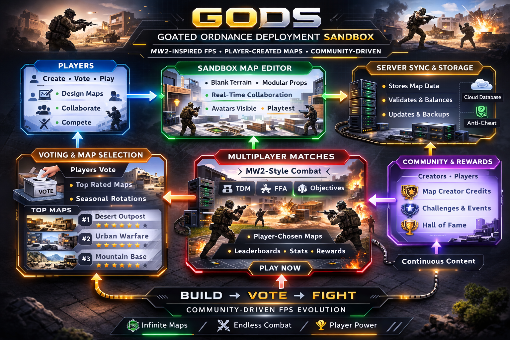

# Goated-Ordnance-Deployment-Sandbox
MW2-inspired FPS with fully player-created maps — public Game Design Document (GDD) for community recognition.
# Goated Ordnance Deployment Sandbox (GODS) – Game Design Document (Concept)

**Author:** Denzil Harvey  
**Date:** 26 February 2026  
**Status:** Concept / Public Design Document  

---

**License:**  
This project is licensed under **Creative Commons Attribution-NonCommercial 4.0 International (CC BY-NC 4.0)**.  
You may share or adapt this work **non-commercially**, with attribution to Denzil Harvey.  

---

## Project Overview

GODS is a conceptual first-person shooter (FPS) that reimagines the fast-paced, skill-based mechanics of classic MW2-style gameplay. Its unique twist: all maps are created, edited, and voted on by the player community. Players experience tactical combat while also designing and testing their own arenas, creating a dynamic, community-driven multiplayer environment.

  

Key Features:

- **MW2-inspired player mechanics:** sprinting, crouching, jumping, aim-down-sights (ADS), realistic recoil, and fast kill times.  
- **Community-driven map creation:** hybrid client-server editing, modular terrain blocks and props, real-time collaboration.  
- **Player-driven map rotation & voting:** maps voted on by players enter multiplayer rotation, rewarding creativity and quality.  

GODS establishes a permanent, public record of the concept while clearly attributing authorship.

---

## 1. Game Overview

- **Title:** Goated Ordnance Deployment Sandbox (GODS)  
- **Genre:** First-Person Shooter (FPS), Multiplayer, Sandbox / Player-Created Content  
- **Platform:** PC (initial), potential expansion to consoles  
- **Goal:** Recreate MW2-era FPS mechanics in a community-driven environment where players design, vote on, and play custom maps.  

**Core Concept:**  
GODS combines classic, skill-based FPS mechanics with community-driven map creation and voting. Players can design maps collaboratively or individually, vote for the best maps, and play in a dynamic, rotating map pool.

---

## 2. Game Mechanics

### 2.1 Player Movement & Combat
- Sprint, crouch, jump, vault over obstacles  
- Aim-down-sights (ADS) with realistic slowdown  
- Recoil and spread modeled per weapon  
- Kill Time-to-Kill (TTK) tuned for fast-paced, competitive play  
- Health, armor, and tactical perks (speed, stealth, stamina)  

### 2.2 Weapons & Loadouts
- Primary, secondary, tactical, and lethal equipment  
- Customizable loadouts per match  
- Optional “killstreak” style field upgrades  

### 2.3 Multiplayer Modes
- Free-for-all  
- Team deathmatch  
- Objective-based modes (optional/future expansion)  

---

## 3. Map Creation System

### 3.1 Hybrid Client-Server Editing
- Most editing occurs client-side for performance  
- Server stores authoritative map state  
- Changes sent as delta updates (object moved, terrain painted, props placed)  

### 3.2 Collaborative Editing
- Multiple players can edit the same map simultaneously  
- Section locking / reservation system to avoid conflicts  
- Real-time position sync: editors see each other’s avatars or “ghosts”  
- Undo and version history  

### 3.3 Map Content
- Maps start blank: modular terrain blocks, walls, props  
- Players can create artwork / textures in-game  
- Lightweight map files (geometry + metadata + compressed textures)  

### 3.4 Voting & Rotation
- Players vote on maps after testing/play sessions  
- Top-rated maps enter multiplayer rotation  
- Seasonal competitions encourage creativity  

---

## 4. Servers & Online Architecture

### 4.1 Dedicated Multiplayer Servers
- Hosts matches using player-approved maps  
- Handles matchmaking, leaderboards, and stats  
- Streams only active maps to reduce memory/bandwidth load  

### 4.2 Map Editing / Synchronization Servers
- Central server stores active maps and syncs real-time edits  
- Validates maps for geometry errors, object limits, and gameplay balance  

### 4.3 Delta-Based Updates
- Only changes to maps or player positions are transmitted  
- Minimizes bandwidth and CPU/GPU load  

---

## 5. Player Avatars During Map Creation
- Editors see each other in real time  
- Optional modes:  
  - Ghost mode: semi-transparent avatars  
  - Hide mode: focus on objects only  
- Enables collaboration, feedback, and in-editor playtesting  

---

## 6. Community & Engagement

### 6.1 Player-Generated Maps
- All maps created and curated by players  
- Encourages experimentation and creativity  
- Voting ensures top-quality maps enter rotation  

### 6.2 Playtesting
- Players can spawn weapons or simulate combat in-editor  
- Feedback informs map adjustments before multiplayer rotation  

### 6.3 Recognition & Attribution
- Map creators credited publicly in-game  
- Voting system rewards creative contributions  

---

## 7. Legal & IP Considerations
- MW2-style mechanics are legal to copy  
- All assets are original or player-generated  
- Branding GODS avoids Call of Duty trademarks  
- Public recognition via GitHub and dev communities  

---

## 8. Non-Monetization Philosophy
- Free-to-play; focus on community recognition and creativity  
- No microtransactions, ads, or paid content  
- Optional voluntary donations for server upkeep  

---

## 9. Technical Notes / Recommendations
- **Engine:** Unreal Engine 5 or Unity  
- **Networking:** Hybrid client-server for map creation; delta updates for efficiency  
- **Map Storage:** Cloud storage for map packages and archives  
- **Scalability:** Modular map system, section locking, delta updates minimize server load  

---

## 10. Concept Art / Branding Ideas
- Acronym GODS central to logo design  
- Neutral tactical color palette (green, gray, black)  
- Maps intentionally blank during creation to highlight player creativity  
- Player avatars visible in-editor to emphasize collaboration  

**Diagrams / Flowcharts:**  

  

---

## 11. Future Expansions (Optional)
- Additional modes: capture-the-flag, objective campaigns, prop hunt, trick-shot lobbies, Mike Myers lobbies  
- Seasonal map creation competitions with cosmetic rewards  
- Cross-platform support (console, mobile companion app)  
- Optional AI-assisted map design / balance tools  

---

## ✅ Summary
GODS is:  
- MW2-inspired mechanics recreated legally and faithfully  
- Fully player-driven maps, editable and votable  
- Hybrid client-server architecture supporting collaboration and multiplayer  
- Community-focused, non-commercial, with full credit to the creator  
- Scalable, engaging, and adaptable to future expansions
